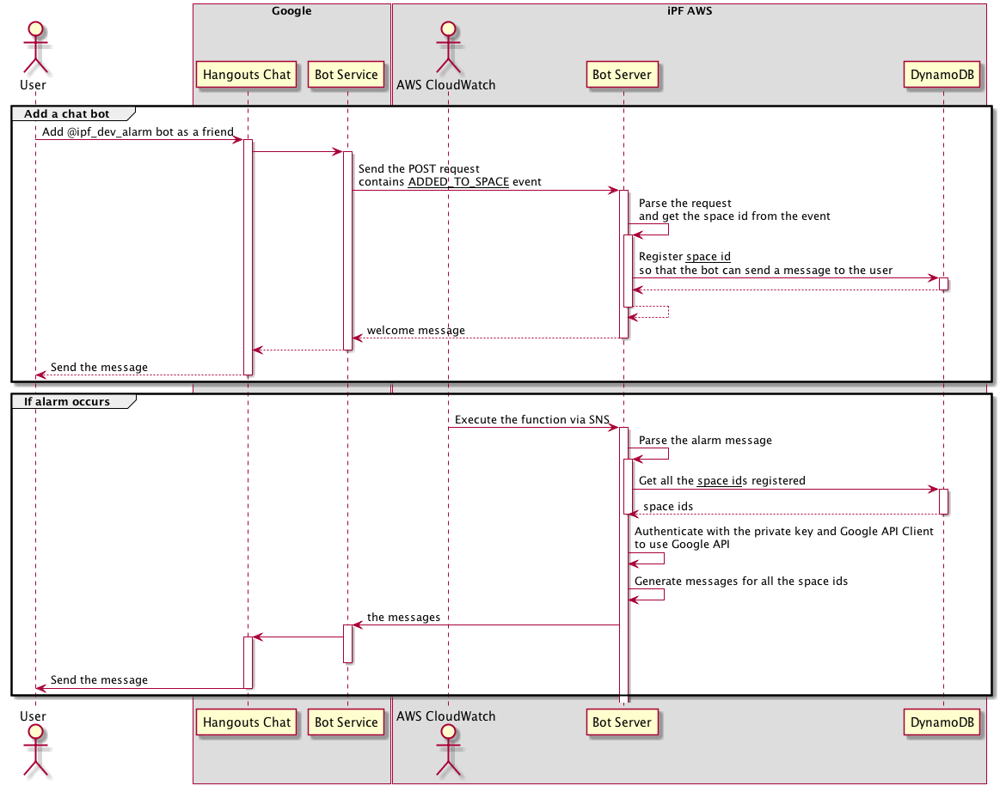

# iPF - Google Hangouts Chat Bot

## Abstract
이 문서는 iPF 업무와 관련된 알림 사항을 Google Hangouts Chat에서 지원하는 Bot을 이용하여 수신 할 수 있도록, Google Hangout Bot을 생성하고 이를 이용하는 방식을 설명하는데 목적이 있다.

## How iPF Chat Bot works

__Figure 1. iPF AWS Alarm Bot의 Activity Diagram__

## 구성 요소

### Google Hangouts Chat
현재(2019년 7월) iPF에서 사용중인 Google Hangout(이하 행아웃 클래식)은 현재 Google에서 신규 서비스인 Hangouts Chat과 Hangouts Meet으로 나누어 [이전이 진행 중](https://www.blog.google/products/g-suite/meet-the-new-enterprise-focused-hangouts/)이며 이전이 완료되면 행아웃 클래식 서비스는 종료될 것으로 예상된다.
행아웃 챗은 행아웃 클래식과 비교했을 때 아래와 같은 특징을 갖는다;
* 대화가 Thread 단위로 진행된다. 이에 따라 클래식에서는 지원하지 않았던 답글 형태의 메시지를 남길 수 있다.
* 대화 내용 검색, 수정 및 삭제가 가능하다.
* Bot, Webhook 연동 등 신규 기능을 지원한다.
행아웃 챗 이용시 행아웃 클래식에서 이루어졌던 개인간 대화는 별도의 이전 작업 없이 이용 가능하나, 클래식에서 이용중이던 Group 대화는 이전되지 않는다.

### Google Chat API
Google Hangouts Chat에서 Bot 지원을 위해 사용하는 API로, 개인 또는 그룹과 Bot간의 메시지 송수신을 가능하게 한다. 자세한 내용은 [Google에서 제공하는 개발 문서](https://developers.google.com/hangouts/chat/) 참고 바람.

#### API 사용 설정 (on Google Developers Console)
해당 API를 이용하기 위해서는 [Google Developer Console](https://console.developers.google.com)에서 API를 활성화(enable)하고, 추가 설정을 마쳐야 한다.
현재 iPF AWS Alarm Bot은 developer@ 계정의 "API Project"에 설정되어 있다.

#### Google Service Account를 이용한 인증
해당 API를 어플리케이션에서 사용하기 위해서는 Google Service Account를 이용한 인증이 필요하다.
Chat Bot의 경우는 복잡한 인증 과정을 Service Account에서 생성한 Private Key로 대체 할 수 있다. 서비스 어카운트는 Callback URL을 이용하여 인증 결과를 처리해야 하는 일반적인 OAuth2 인증 과정을 거치지 않고, service(application)-to-service(Google API)간 인증이 진행된다. 서비스 어카운트의 생성과 이용 방법은 아래와 같다.
1. Google Developer Console 접속 후 IAM & Admin 메뉴에서 Service Account 생성
  * Role은 설정하지 않고 남겨 둔다.
  * Private Key JSON 파일 형태로 내려 받는다. 
2. 내려 받은 json 파일을 코드에 포함시키고, GOOGLE_APPLICATION_CREDENTIALS 환경 변수로 지정(i.e., `process.env.GOOGLE_APPLICATION_CREDENTIALS = require('pk.json');`)한다.
3. 어플리케이션에 Google API Client를 추가하고, 인증이 필요한 시점에 `google.auth.getClient` 메소드를 호출한다.

**Notes** 사용자가 보내온 요청 또는 DM에 반응하는 과정(어플리케이션의 endpoint를 통해 모든 커뮤니케이션이 완료)에서 인증은 생략됨. Bot이 사용자에게 먼저 메시지를 보내고자 할 경우, 즉 Google API를 이용할 경우에만 인증 과정을 진행함.

### Bot Server

#### API Gateway
Google Chat API의 Connection endpoint(아래 그림에서 Bot implementation endpoint)로 사용된다.

#### Lambda
API Gateway로의 요청 또는 SNS를 통해 실행되며, 수신한 이멘트에 따라 이에 적절한 응답을 생성, 전달하는 역할을 수행한다.
* Repository: ipf-chatbot (ssh://git-codecommit.ap-northeast-2.amazonaws.com/v1/repos/ipf-chatbot)
* Runtime: nodejs10.x 
* Functions
  * alarm-listen: iPF AWS Alarm Bot의 endpoint. 사용자가 Bot을 대화방에 추가하거나, 메시지를 발송했을 때 실행되어, 추후 알람 메시지를 발송할 수 있도록 대화방의 id(`space id`)를 기록하는 역할을 한다.
  * alarm-event: CloudWatch에서 Alarm이 발생했을 때 실행되어 등록된 사용자들에게 알람 메시지를 발송하는 역할을 한다.
* 필요 권한 (Role)
  * AWSLambdaBasicExecutionRole
  * DynamoDB에 item 추가 및 수정, 삭제   
* [Serverless Framework](https://serverless.com/framework/docs/providers/aws/guide/quick-start/)를 이용하여 구축, 테스트, 배포되었음

#### DynamoDB
봇을 구독하는 사용자의 정보를 기록하는 data storage다. 저장된 정보는 봇이 사용자에게 먼저 메시지를 보내고자 할 경우 이용된다.
* Table name: chatbots
* Keys
  * Partition key: bot_id
  * Sort key: space_id   

## How to send a message to users via the bot

### iPF AWS Alarm Bot
AWS SNS Topic(ipf-aws-alarm-bot, `arn:aws:sns:ap-northeast-2:572836591883:ipf-aws-alarm-bot
`)으로 아래와 같은 형식의 메시지를 Publish한다.

~~~ json
{
    "AlarmName": "알람의 이름. CloudWatch에서 자동 생성된 메시지가 아닐 경우, 이 내용이 맨 첫줄에 표시된다. e.g., {AlarmName} Alarm이 발생했습니다.",
    "StateChangeTime": "알람이 발생한 시간. ISO8601 포맷 e.g., 2018-05-22T20:38:49.939+0000",
    "NewStateReason": "알람이 발생한 원인",
    "Trigger": {
        "Namespace": "Alarm이 발생한 AWS 리소스의 네임 스페이스 e.g., AWS/ElasticBeanstalk",
        "MetricName": "모니터링 된 요소 e.g., CPU Utilization",
        "Unit": "요소의 측정 단위 e.g., Percentage",
        "Statistic": "요소의 측정 기준 e.g., AVERAGE",
        "Dimensions": [
            {
                "name": "Alarm이 발생한 어플리케이션의 이름 e.g., tapas-prod-example"
            }
        ],
    }
}
~~~

**Notes** CloudWatch에서 발송하는 알람일 경우 아래 메시지는 포맷에 맞게 자동으로 생성된다. 커스텀한 메시지일 경우에 아래 모든 항목이 누락되지 않도록 주의한다.

## References
* [Google API Nodejs Client](https://github.com/googleapis/google-api-nodejs-client)
* [Send CloudWatch Alarms to Slack with AWS Lambda](https://cloudonaut.io/send-cloudwatch-alarms-to-slack-with-aws-lambda/)
* [Integrate elastic beanstalk health check with slack using cloud watch alarm
](http://crazykoder.com/2018/07/28/integrate-elastic-beanstalk-health-check-with-slack-using-cloud-watch-alarm/)